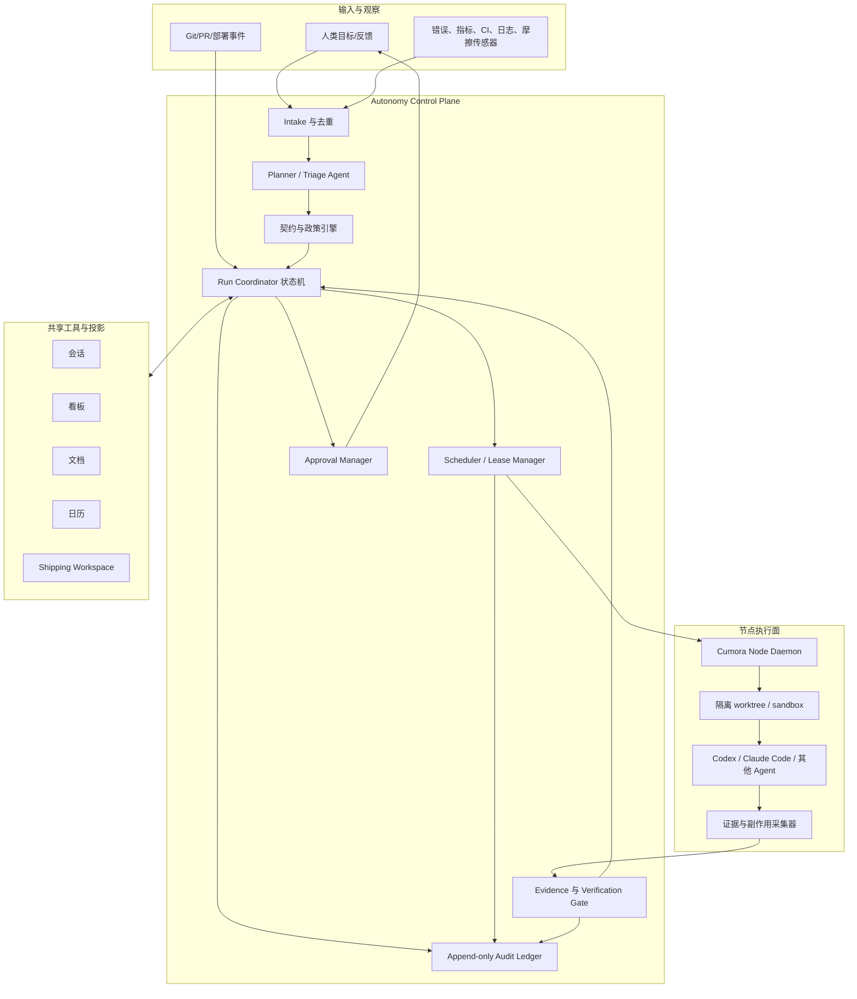

# 自治项目：整体设计与演进路线

> 状态：设计提案
>
> 第一阶段目标：让 Cumora 使用本机制持续迭代自身；同一套机制随后可以通过配置扩展到其他代码项目。

## 1. 摘要

Cumora 的目标不是让用户持续给多个 Agent 分派细碎指令，而是让人预先定义项目愿景、运行契约、环境和权限边界，然后由系统持续完成：

```text
发现机会 → 建立工作项 → 调查 → 实现 → 独立验证 → Staging 验收
→ 请求合入 master → 生产发布 → 回读 → 学习 → 继续发现
```

人的默认角色是：

1. 制定并审批项目愿景和项目运行契约。
2. 在需求存在实质歧义、风险越界或证据冲突时作决策。
3. 审批最终合入受保护的主分支。

系统由两个执行平面组成：

- **Autonomy Control Plane**：持续观察项目、形成计划、执行调度、应用政策、管理审批和审计，但不直接在生产节点上随意执行命令。
- **节点执行面**：运行 Codex、Claude Code 或其他 coding agent，在隔离工作区内调查、修改、测试、部署 Staging 和收集证据。

看板、文档、日历、会话和 Shipping 不是自治控制器本身，而是 Agent 可使用的共享工具、长期上下文、人工交互面和运行时留痕投影。真正的流程正确性由服务端状态机、权限策略和证据门禁保证。

## 2. 设计目标与非目标

### 2.1 目标

- 用户只需提交一个目标，例如“修复会话重复”，系统即可推进到等待合入 master。
- Agent 可以从错误、指标、反馈和运行摩擦中主动发现问题，去重后形成工作项并持续处理。
- 每个动作、判断、外部副作用和状态变化均可审计、回放和归因。
- 高风险、歧义或越界行为会形成持久审批请求，而不是在聊天中静默等待。
- 项目愿景和运行契约均版本化；Agent 可提出修改提案，但不能自行激活。
- Autonomy Control Plane 与节点执行器解耦；项目可以选择 Cumora Cloud Runtime 节点或自有节点。
- 第一阶段在 Cumora 仓库自举，后续接入其他项目不需要修改核心状态机。

### 2.2 非目标

- 不以“更长的系统提示词”替代权限、状态机、租约、幂等和数据库约束。
- 不允许 Agent 在没有工作项、证据或预算边界时无限探索和修改项目。
- 不承诺所有问题都无需人工参与；目标是把人工参与收敛到真正需要判断的关口。
- 第一阶段不支持任意多仓库事务、跨组织发布编排或完全无人值守的生产数据变更。
- 看板列、聊天措辞和 Agent 自报完成不能作为交付成功的唯一依据。

## 3. 核心原则

### 3.1 确定性骨架，非确定性决策

状态迁移、权限检查、预算、租约、审批和证据要求必须由确定性代码执行。LLM 只能在受限步骤中提出计划、分类、实现或建议动作；它不能绕过状态机直接宣布任务完成。

### 3.2 意图、政策、执行分离

- **项目愿景**回答“长期为什么做、要成为什么”。
- **项目运行契约**回答“允许怎样做、完成必须证明什么”。
- **工作项**回答“这一次要改变什么”。
- **执行 Run**回答“由谁、在哪个环境、使用哪个版本的契约完成”。

### 3.3 证据先于状态

“测试通过”“已部署”“用户路径正常”必须引用可验证的 Evidence。没有证据的文字陈述只能是日志，不能打开下一道门禁。

### 3.4 构建者与验证者分离

实现 Agent 不能独立完成自己的必要验证。独立验证应使用不同 Agent、不同上下文或确定性检查器；高风险任务应至少有一个非构建者 Evidence Square。

### 3.5 默认最小权限

节点只收到本次任务需要的短期凭据、仓库范围和环境权限。生产发布、数据删除、权限提升和主分支合入默认需要审批。

### 3.6 自主性必须可停止

每个项目、工作项和 Run 都有暂停、取消、预算耗尽和 Kill Switch。系统崩溃或节点离线后从持久状态恢复，不依赖某个模型会话继续存活。

## 4. 总体架构



产品可以用一个统一入口呈现自治进度，但架构上不再称其为“Cloud Agent”。Autonomy Control Plane 必须拆成状态机服务、政策引擎、调度器和若干受限模型步骤，避免把系统可靠性绑定在一个长期对话 Persona 上。Persona、Control Plane、Worker 与 Engine/Host 的规范关系见 [`agent-mechanisms/00-agent-architecture.md`](agent-mechanisms/00-agent-architecture.md)。

## 5. 领域模型

### 5.1 Project

项目是自治边界，关联一个或多个仓库、环境、Agent Team 和共享资产。

关键字段：

- `company_id`
- `name`、`description`、`status`
- `repository_bindings`
- `active_vision_version_id`
- `active_contract_version_id`
- `default_conversation_id`
- `board_id`、`calendar_scope`
- `autonomy_mode`: `observe | propose | execute_safe | execute_with_gates`
- `paused_at`、`pause_reason`

### 5.2 Project Vision

愿景是版本化的长期方向，包含：

- 目标用户与核心问题
- 产品要形成的长期能力
- 成功信号与反目标
- 明确不做的事情
- 当前战略约束

愿景对 Planner 有指导作用，但不能直接授权一个高风险动作。

### 5.3 Project Operating Contract

运行契约是机器可执行政策，包括：

- 仓库、默认分支和允许修改的路径
- 安装、检查、测试、构建命令
- 环境、部署命令、健康检查和回滚方式
- Definition of Done 与必要 Evidence Squares
- 自动允许、禁止和需要审批的动作
- 成本、时间、并发、重试和变更规模预算
- Agent 角色、独立验证要求和升级规则
- 问题发现来源、阈值、冷却时间和 WIP 上限

每个 Run 固定引用启动时的契约版本。契约更新不会在中途悄悄改变正在执行的 Run；需要显式重新规划或迁移。

### 5.4 Proposal

Agent 可以提交以下提案：

- `vision_change`
- `contract_change`
- `scope_change`
- `architecture_decision`
- `budget_exception`
- `risk_acceptance`

提案必须包含结构化 diff、理由、证据、影响分析、迁移方式和回滚方式。只有有权限的人批准后才能创建新版本并激活。

### 5.5 Work Item

Work Item 是控制面的最小工作单位，不等同于一条聊天消息或看板卡片。

```text
Candidate → Triaging → Ready → Claimed → Investigating → Implementing
→ Verifying → Staging → Awaiting Merge → Merged → Production Watching → Learned
```

旁路状态：`Needs Decision`、`Blocked`、`Failed`、`Cancelled`、`Superseded`。

建议字段：

- 标题、问题陈述、期望结果和验收条件
- 来源、证据、置信度、影响和风险
- `project_id`、`parent_id`、去重指纹
- owner role、当前 lease、优先级和预算
- 关联 conversation、board card、document、shipping feature
- 当前状态、状态原因和下一允许动作

### 5.6 Run、Step 与 Attempt

- **Run**：一次端到端推进，固定项目愿景、契约、模型和环境快照。
- **Step**：调查、实现、测试、验证、部署等确定性阶段。
- **Attempt**：某个 Step 在某个节点和 Agent 上的一次执行，可重试但必须有幂等键。

现有 `agent_runs` 继续表示一次 Agent turn；新增的项目 Run 是更高层级的业务执行，两者通过 `project_run_id` 关联，不应混为一张表。

### 5.7 Evidence

Evidence 是不可变记录，至少包含：

- 类型：测试、构建、diff、日志、截图、指标、部署、人工确认等
- 产生者与执行环境
- 命令、退出码和时间窗口
- 原始输出位置、摘要和内容哈希
- 关联 commit、branch、artifact、deployment
- 是否可重放、是否过期
- 验证结论和验证者

现有 Shipping Evidence Squares、release smoke 和 production readback 应直接复用。

### 5.8 Approval Request

审批是持久对象，不只是聊天中的一句请求。它包含：

- 被阻塞的 Work Item / Run / Step
- 需要作出的一个明确决定
- 推荐选项、备选项和默认安全行为
- 风险、证据、diff、预算影响
- 请求者、允许审批的角色、过期时间
- 审批结果、审批人、评论和政策依据

## 6. 项目运行契约示例

```yaml
apiVersion: cumora.ai/v1alpha1
kind: ProjectContract
metadata:
  project: cumora
spec:
  repositories:
    - id: cumora
      url: https://github.com/yetone/cumora.git
      defaultBranch: master
      protectedBranches: [master]

  workspace:
    strategy: git-worktree
    branchPrefix: cumora/
    cleanRequired: true

  commands:
    install: npm install
    checks:
      - npm run typecheck
      - npm run server:typecheck
      - npm run build
    unitTest: npm test
    integrationTest: npm run test:integration

  environments:
    staging:
      deployAdapter: kubernetes
      kubeContext: cumora-staging
      healthchecks:
        - GET https://staging.example/api/health
    production:
      deployAfterMasterMerge: true
      approvalRequired: true
      rollbackRequired: true

  permissions:
    automatic:
      - repository.read
      - branch.create
      - code.write
      - test.execute
      - staging.deploy
      - artifact.update
    approvalRequired:
      - master.merge
      - production.deploy
      - database.destructive
      - secrets.change
      - permissions.change
    denied:
      - force_push.protected_branch
      - production.shell.unbounded

  verification:
    independentVerifierRequired: true
    requiredSquares:
      - regression-test
      - user-path
      - staging-smoke
      - release-note

  budgets:
    maxConcurrentWorkItems: 2
    maxAttemptsPerStep: 3
    maxRunMinutes: 90
    maxCostUsd: 10
    maxChangedFilesWithoutApproval: 30

  discovery:
    enabled: true
    sources: [ci, runtime-errors, friction, production-readback]
    autoExecuteMaxRisk: low
    minimumConfidence: 0.8
    candidateCooldownHours: 24
```

契约存储时应保留原始 YAML、解析后的规范 JSON、schema 版本、内容哈希和审批记录。

## 7. 自治交付状态机

### 7.1 Intake 与去重

输入可能来自人类消息、看板、CI、运行错误、Shipping friction 或监控。Intake 负责：

1. 保存原始信号，生成稳定 `source_key`。
2. 提取问题、范围和证据。
3. 使用确定性键加语义相似度查找已有 Candidate / Work Item。
4. 合并重复证据，而不是重复建卡和重复唤醒 Agent。
5. 创建 Candidate，等待 Triage。

### 7.2 Triage 与计划

Planner 读取愿景、契约、项目文档、历史决策和候选证据，输出受 schema 约束的计划：

```json
{
  "verdict": "accept",
  "risk": "medium",
  "confidence": 0.91,
  "problem": "...",
  "desiredOutcome": "...",
  "acceptanceCriteria": ["..."],
  "steps": ["investigate", "implement", "verify", "staging"],
  "requiredCapabilities": ["repo:write", "node", "kubernetes:staging"],
  "approvalNeeds": ["master.merge"]
}
```

政策引擎验证计划。如果风险、能力、预算或范围不满足契约，状态进入 `Needs Decision`。

### 7.3 Claim 与执行

Scheduler 根据节点能力、在线状态、负载和 Agent 角色选择执行者，创建带 TTL 的 lease。节点收到签名 Job Envelope：

- 项目、Work Item、Run、Step、Attempt 标识
- 愿景和契约版本/哈希
- 仓库与基线 commit
- 允许的工具、路径、网络和环境
- 输入证据与验收标准
- 时间、成本和输出限制
- 幂等键和 lease 到期时间

节点必须先创建隔离 worktree/branch，再启动 Codex 等 coding agent。所有工具调用经过节点策略代理或至少被完整记录。

### 7.4 调查与实现

执行 Agent 自主完成代码搜索、复现、根因分析、修改和测试。它可以申请拆分子工作项，但不能在没有控制面批准的情况下扩大到无关范围。

调查结果应形成结构化记录：

- 观察事实
- 被验证或排除的假设
- 根因及其证据
- 选定方案、替代方案和权衡
- 预计风险与回滚方式

### 7.5 独立验证

实现完成后，Coordinator 创建新的 verification Attempt。验证者获得需求、diff 和证据，但不继承构建者的完整推理，以减少结论锚定。

验证者不能修改构建分支来“顺手修好”；验证失败应返回可复现 Evidence，并将工作项退回 `Implementing` 或请求决策。

### 7.6 Staging、合入与生产

- Staging 部署可在契约允许时自动执行。
- smoke 必须覆盖任务的用户路径，而不只是 `/health`。
- 所有门禁满足后自动创建或更新 PR，工作项进入 `Awaiting Merge`。
- 人类审批并合入 master 是第一阶段唯一必需的人类终点。
- master webhook 触发生产发布；是否仍需单独生产审批由契约决定。
- 发布成功后进入 Watching；按日历/延迟任务执行生产 readback。
- readback 失败自动创建 friction/regression，并回到 Building；是否自动回滚由契约和风险决定。

## 8. Autonomy Control Plane

### 8.1 组件职责

| 组件 | 职责 | 是否使用 LLM |
| --- | --- | --- |
| Intake | 信号持久化、指纹、初步去重 | 可选分类 |
| Planner | 问题理解、计划、验收标准、角色选择 | 是，结构化输出 |
| Policy Engine | 权限、预算、状态迁移和门禁 | 否 |
| Run Coordinator | 推进状态机、创建 Step/Attempt | 否 |
| Scheduler | 节点匹配、lease、重试、超时 | 否 |
| Approval Manager | 创建、阻塞、通知、消费审批 | 否 |
| Verification Gate | 检查 Evidence Square 和独立性 | 否/受限分类 |
| Audit Ledger | 保存不可变事件和引用 | 否 |
| Artifact Projector | 更新看板、会话、文档、日历视图 | 否 |

### 8.2 调度规则

- 一个 Work Item 同时最多有一个 active execution lease。
- 调查和验证可以使用不同 Agent；实现同一文件范围的工作项默认不并行。
- 节点离线不等于失败：lease 到期后重新调度，旧 Attempt 的迟到结果以 fencing token 拒绝。
- 同一幂等键的部署、建卡、PR 和通知只能生效一次。
- 重试必须创建新 Attempt 并引用前一次失败证据，不能覆盖历史。

## 9. 节点执行面

### 9.1 Node Daemon

现有 BYOA daemon 演进为通用节点执行器，并持续上报：

- 操作系统、架构、可用引擎和版本
- 仓库缓存和磁盘容量
- 可用工具链、容器和浏览器能力
- 可访问的环境适配器，但不上传真实 secret
- 当前负载、心跳、并发额度和健康状态

### 9.2 Runner Adapter

统一接口屏蔽 Codex、Claude Code 等差异：

```ts
interface CodingAgentRunner {
  start(job: JobEnvelope): AsyncIterable<RunnerEvent>
  steer(attemptId: string, message: string): Promise<void>
  cancel(attemptId: string): Promise<void>
  resume(attemptId: string, checkpoint: string): AsyncIterable<RunnerEvent>
}
```

RunnerEvent 至少覆盖：思考阶段摘要、工具调用、文件变更、命令结果、提问、预算、checkpoint 和终态。模型的隐式思维链不保存；保存对审计有用的决策摘要和事实证据。

### 9.3 隔离与凭据

- 每个 Run 使用独立 worktree；脏工作区不复用。
- 受保护分支只读，禁止 force push。
- Secret 通过短期 capability token 或节点本地引用注入，不写入 prompt、事件或 artifact。
- kubeconfig 必须固定允许的 context/namespace；生产 context 默认不可用于普通实现 Step。
- shell、网络、文件路径和外部 API 操作按契约分类并记录。

## 10. 看板、文档、日历、会话和 Shipping 的定位

### 10.1 看板

看板是 Work Item 状态的用户可见投影和人工操作面：

- 创建/移动卡片可以转化为控制面命令。
- 控制面状态迁移会反向更新卡片。
- 卡片不能凭一次拖拽绕过验证门禁；非法移动应被拒绝或形成 override approval。
- 卡片评论保存进展摘要和 Evidence 链接，不保存唯一状态。

### 10.2 文档

文档提供版本化长期上下文：Product Vision、Architecture、Decision Log、Runbook 和 Release Learning。Agent 可以共同编辑，但激活的愿景和契约必须来自已审批版本，不能直接以文档最新内容为准。

### 10.3 日历

日历表达人可理解的计划、定期 Triage 和 readback。可靠执行由持久化调度任务负责；删除 UI 日历事件必须同步取消对应 job，不能让 Node timer 成为唯一状态。

### 10.4 会话

会话用于目标输入、过程通知、Agent 协作和审批讨论。控制面只把关键进展发布到会话，避免把每个工具调用变成聊天噪声。正式审批必须回写 Approval 对象。

### 10.5 Shipping

现有 Shipping lifecycle 继续负责：功能契约、不变量、独立 Evidence Squares、Staging/Production release、smoke、rollback 和 readback。自治项目控制面负责“让谁在什么时候执行下一步”，而 Shipping 负责“证据是否足以通过交付门禁”。

## 11. 审计与可观测性

### 11.1 Append-only 事件

所有关键行为写入统一项目事件流：

```text
candidate.observed
work_item.created / deduplicated / state_changed
run.planned / started / completed / failed
attempt.assigned / heartbeat / timed_out / cancelled
tool.requested / allowed / denied / completed
evidence.recorded / verified / expired
approval.requested / approved / rejected / expired
proposal.created / approved / activated
deployment.started / completed / rolled_back
readback.passed / failed / overdue
```

事件包含 actor、时间、项目、Work Item、Run、Attempt、契约版本、因果事件、幂等键和结构化 data。大体积输出存对象存储，事件只保存哈希、摘要和地址。

### 11.2 决策记录

每个重要决策必须回答：

- 当时知道哪些事实？
- 评估过哪些方案？
- 为什么选择当前方案？
- 哪条愿景或契约规则支持/阻止了它？
- 哪些未知风险仍存在？
- 什么证据会使决定失效？

现有 `agent_runs`、`agent_events`、`tool_calls` 和 `llm_calls` 作为底层执行证据，通过 Run/Attempt ID 汇入项目时间线。

## 12. 审批与升级

以下情况默认创建 `Needs Decision`，暂停相关分支而不是让 Agent 猜测：

- 愿景或验收标准存在会改变方案的歧义。
- Agent 请求修改愿景、契约、权限或预算。
- 变更超出允许路径、规模或风险等级。
- 构建者与验证者结论冲突。
- 关键测试不可运行或证据过期。
- 涉及生产数据、secret、权限、账单或不可逆外部动作。
- 超过重试、时间、成本或并发预算。
- Staging 行为与预期不一致。
- 生产 readback 恶化且自动回滚不安全。

安全默认值是保持现状。审批超时不能自动解释为批准。

## 13. 主动发现闭环

### 13.1 传感器

优先支持可产生客观证据的来源：

- CI/build/test 失败
- 服务错误、延迟、资源和健康检查
- Shipping friction、regression 和 overdue readback
- 用户反馈、重复问题和管理员报告
- Agent 执行中遇到的环境摩擦
- 依赖、安全和静态分析告警
- 看板长期阻塞与 SLA 超时

### 13.2 防止自我膨胀

- 传感器先创建 Candidate，不直接唤醒 coding agent 修改代码。
- Candidate 必须去重、评分并满足最小置信度。
- 项目有全局 WIP 和每日发现预算。
- Agent 派生的新工作项必须引用原始证据和父工作项。
- 同一 source/fingerprint 有冷却时间。
- 低价值、反复失败或无人采纳的来源自动降权。
- 自动执行只覆盖契约允许的风险等级；其他 Candidate 等待 Triage/审批。

## 14. 建议数据模型

建议新增或扩展：

```text
project_visions
project_contract_versions
project_proposals
project_repository_bindings
project_environments
project_sensors
project_work_items
project_work_item_links
project_runs
project_run_steps
project_attempts
project_evidence
project_approval_requests
project_events
node_capabilities
node_job_leases
```

现有表的关系：

- `projects`：扩展为自治项目根，或引入一对一 `project_automation_settings` 以降低迁移风险。
- `board_cards`：通过 link 表映射 Work Item，不复制状态真相。
- `documents`、`conversations`、`calendar_events`：作为上下文和投影链接。
- `shipping_features`：承担复杂功能的交付合同和发布门禁。
- `agent_runs/events/tool_calls/llm_calls`：承担 Attempt 内部的执行与成本明细。
- `computers`：演进为节点注册与能力入口。

## 15. 当前基础与核心缺口

### 15.1 可直接复用的能力

- `projects`、会话、看板、文档和日历已经提供租户内共享上下文。
- idle/agenda/scheduler 已能从卡片、日历和 stalled conversation 产生主动 wake。
- Cloud pod 与 BYOA daemon 已支持托管模型、Codex、Claude Code 等执行路径。
- freshness、work claim、debounce 和并发预算已解决部分多 Agent 冲突。
- `agent_runs`、`agent_events`、`tool_calls`、`llm_calls` 已提供底层运行审计和成本账本。
- Shipping 已有功能合同、独立验证、Staging、生产审批、smoke、回滚和 readback 门禁。
- release 文档和 Kubernetes 部署路径可作为 Cumora 自举环境的起点。

### 15.2 第一阶段必须补齐的缺口

- Project Vision 与 Operating Contract 还不是版本化、可审批、可执行的一等对象。
- 当前 wake 触发的是一次 Agent turn，不是可恢复的端到端 Project Run。
- 看板卡片与 Agent 私有 task 缺少统一 Work Item、状态机、lease 和 fencing token。
- Autonomy Control Plane 已能向节点发送 contract-pinned coding Job Envelope，但还缺少显式 `requiredCapabilities`、Persona responsibility assignment 和服务端认证的 Worker identity。
- 节点事件偏向聊天 turn，缺少标准化 diff/test/deploy Evidence 回传。
- 审批主要存在于 UI 操作或聊天语义中，缺少统一 Approval Request。
- Shipping 约束交付证据，但尚未被 Coordinator 自动驱动。
- 主动发现仍以 agenda/idle 为主，缺少项目 Sensor、Candidate 去重和风险分级。

第一阶段的原则是补齐这些连接层，不重写已经工作的聊天、节点、审计或 Shipping 子系统。

## 16. 第一阶段：Cumora 自举

### 16.1 范围

第一阶段只承诺一条可靠纵向闭环：

> 在 Cumora 项目群发送“修复会话重复”后，系统自动调查、创建隔离分支、实现、测试、独立验证、部署 Staging、完成用户路径验收并创建 PR，最后停在等待人类合入 master。合入后自动生产发布并生成 readback。

约束范围：

- 一个自治项目：Cumora。
- 一个主仓库和受保护的 `master`。
- 至少一个在线节点和一个 Codex runner。
- 同时最多一个实施型 Work Item，先证明正确性再扩大并发。
- 手工消息 Intake 为主，附带一个主动发现来源。
- Staging 自动，master 合入必须人工审批。
- 生产发布复用现有 release 流程和契约。

### 16.2 交付切片

#### Slice A：项目配置与契约

- 为 Cumora 建立 Project Vision v1 和 Contract v1。
- 增加 schema 校验、版本、diff 和审批激活。
- 在 Run 创建时固化版本与内容哈希。
- 提供项目暂停和全局 Kill Switch。

#### Slice B：Work Item 与控制面状态机

- 从项目会话中的明确指令创建 Work Item。
- 建立状态迁移、lease、重试、预算和幂等。
- 将 Work Item 投影到专用看板。
- 关键状态变化发布到项目会话。

#### Slice C：节点 coding job

- 扩展 BYOA daemon 支持 Job Envelope 和 RunnerEvent。
- 在节点创建隔离 worktree 与 `cumora/<work-item>` 分支。
- 允许 Codex 读取契约、自主调查和修改代码。
- 回传 diff、命令结果、测试和决策摘要。

#### Slice D：验证与 Staging

- 运行契约规定的 typecheck/test/build。
- 使用独立 Agent 做需求与回归验证。
- 自动部署 Staging，执行 API 和 UI 用户路径 smoke。
- 将证据写入 Shipping Evidence Squares。

#### Slice E：PR、审批和生产回读

- 自动创建 PR，附根因、方案、测试、Staging 和风险摘要。
- 创建 `master.merge` Approval Request。
- Git webhook 感知合入，驱动生产发布。
- 发布后按契约创建 readback，失败自动进入 friction/regression。

#### Slice F：最小主动发现

- 首选接入 CI 失败或生产 error alert 之一。
- 自动创建并去重 Candidate。
- 低风险、高置信 Candidate 可自动进入 Ready；其余等待 Triage。
- 至少证明一个非人类输入的问题能走到 PR 审批。

### 16.3 第一阶段验收标准

- 一条用户指令无需后续常规催促即可到达 `Awaiting Merge`。
- Run 崩溃、服务重启或节点断线后不会丢失状态或重复部署。
- 所有外部副作用都有 actor、契约版本、Attempt 和 Evidence。
- 构建者不能通过自己的必要验证。
- 不满足契约时会形成可操作审批请求，而不是无限重试。
- 人类能从 UI 重放“为什么改、改了什么、如何验证、部署了什么”。
- master 未审批前无法合入；生产不可通过普通实现权限直接操作。
- 合入后能够完成生产部署与 readback，失败可形成下一工作项。
- Agent 能提交契约修改提案，但未经审批不会影响新 Run。

### 16.4 第一阶段暂不实现

- 多仓库原子提交。
- 多项目公平调度和复杂配额售卖。
- 任意第三方部署平台。
- 无人审批的生产数据库迁移。
- 多个 coding agent 同时修改重叠代码区域。
- 仅凭模型视觉判断的生产验收。

## 17. 扩展到自定义项目

Cumora 自举跑通后，第二阶段将项目差异收敛到配置和 Adapter：

### 17.1 Project Bootstrap Wizard

用户选择仓库、节点和 Agent Team，系统在只读模式下探测：

- 语言、包管理器、测试和构建命令
- CI 配置、默认分支和保护规则
- Docker/Kubernetes/部署脚本
- 健康检查、已有 runbook 和 AGENTS.md

Agent 生成 Vision/Contract 草案，人类审阅后激活。任何探测结果都只是建议，不能自动获得生产权限。

### 17.2 Adapter 边界

- `RepositoryAdapter`：GitHub、GitLab、本地 Git。
- `RunnerAdapter`：Codex、Claude Code、Grok Build。
- `DeployAdapter`：Kubernetes、SSH、Cloudflare、用户脚本。
- `SensorAdapter`：CI、Sentry、Prometheus、日志、工单。
- `EvidenceAdapter`：命令输出、浏览器 smoke、指标查询、人工确认。
- `ApprovalAdapter`：Cumora UI，后续可扩展到 Git provider 或外部审批系统。

适配器只负责外部协议，不决定状态迁移和政策。

### 17.3 可移植性验收

第二个项目接入时应只需要：

1. 创建 Project。
2. 配置仓库、节点和环境 Adapter。
3. 审批 Vision v1 与 Contract v1。
4. 绑定项目会话、看板、文档和 Agent Team。

不应为第二个项目添加硬编码分支或复制调度器。

## 18. 后续演进

### Phase 2：多项目与模板

- 自定义项目向导和契约模板。
- 多项目队列、公平调度、项目/公司预算。
- 更多 Git、CI、部署和监控 Adapter。
- Contract 静态分析与 dry-run。

### Phase 3：更强的主动发现

- 多传感器关联、异常聚类和影响评估。
- 从生产 readback 自动形成回归资产。
- 基于采纳率、回滚率和误报率调整 Sensor 信任度。
- 项目级季度愿景审视与契约改进提案。

### Phase 4：组合式交付

- 多仓库依赖图和有序发布。
- 多节点并行但文件/服务范围互斥。
- canary 指标门禁和契约允许的自动回滚。
- 跨项目共享能力与组织级政策继承。

## 19. 成功指标

### 自主性

- 从指令到 `Awaiting Merge` 的无人工干预比例。
- 主动发现问题进入有效修复的比例。
- 每个 Work Item 的人工消息/审批次数。

### 正确性

- 独立验证失败率、生产回滚率、readback 失败率。
- 重复 Work Item、重复部署和越权动作数量。
- Evidence 完整率与可重放率。

### 效率

- 指令到 PR、PR 到生产、生产到 readback 的时间。
- 每个有效交付的模型成本、节点时间和重试次数。
- Agent 等待节点、审批和环境的时间分布。

### 治理

- 未经审批的高风险动作必须为零。
- 审批请求中包含完整证据和明确选项的比例。
- 愿景/契约变更可追溯率和旧 Run 版本固定率。

## 20. 关键风险与对策

| 风险 | 对策 |
| --- | --- |
| Agent 为了“持续改进”制造无穷工作 | Candidate 层、WIP、预算、证据阈值、冷却和 Kill Switch |
| 看板与真实状态分叉 | 控制面为 source of truth，看板为受控投影 |
| Prompt 约束被绕过 | 服务端政策、节点 sandbox、短期 capability 和数据库门禁 |
| 节点重连导致重复副作用 | lease fencing、幂等键、append-only Attempt |
| 构建者自证正确 | 独立 verifier + Shipping Evidence Square 约束 |
| 审计信息过多不可读 | 原始事件留存，生成分层摘要和关键决策视图 |
| Secret 泄漏到模型或日志 | 节点本地 secret 引用、输出脱敏、禁止 prompt 注入真实凭据 |
| 自动修复造成范围蔓延 | 路径/文件/成本预算，scope change approval |
| 愿景/契约被 Agent 渐进篡改 | 版本化 Proposal，仅人类可激活，Run 固定版本 |

## 21. 待确认设计决策

第一阶段实现前需要由项目负责人确认：

1. Cumora 的 canonical Vision v1 和 Contract v1 内容。
2. 第一阶段 staging/production 的真实部署命令、kube context 和 smoke 用户路径。
3. master 合入后生产部署是否仍需要第二次人工审批。
4. 首个主动 Sensor 选择 CI 失败还是生产错误告警。
5. PR 创建采用节点 Git 凭据、GitHub App，还是 Autonomy Control Plane 的 Git provider Adapter。
6. 独立验证优先使用另一 Agent，还是同一节点上的全新隔离模型会话。
7. 原始命令输出和截图的保留周期、对象存储和脱敏规则。

这些决定应以 Contract/Architecture Proposal 进入审批，而不是隐藏在实现代码或环境变量中。
