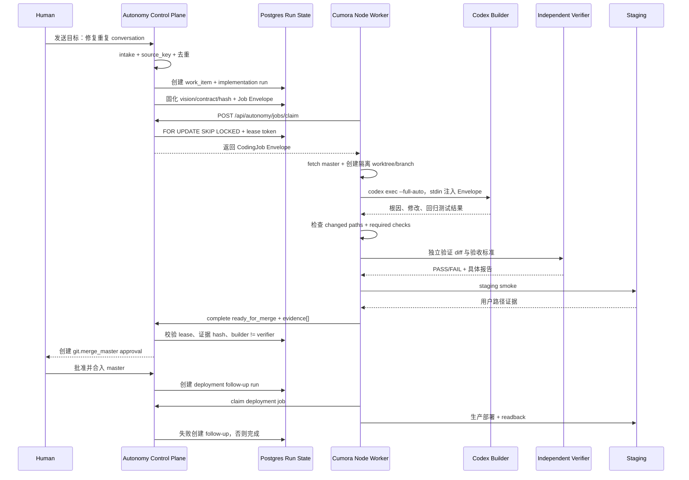

# Autonomy Control Plane 如何调度 Codex Worker：一个典型 Loop Task

## 1. 结论先行

在 Cumora 的自治项目设计里，Autonomy Control Plane 不应被实现成一个拥有仓库写权限的“超级 Agent”。更准确的分工是：

```text
Autonomy Control Plane
  理解目标、读取愿景与契约、拆解步骤、选择能力、创建 Run、检查证据、推进状态

Codex Worker / Execution Plane
  在被分配的隔离 worktree 中调查、修改、测试、执行 Staging smoke，并回传证据

独立 Verifier
  在不继承 builder 完整推理的前提下检查 diff、回归风险和验收标准

Human
  处理实质歧义、越权/风险例外，以及 protected branch 的最终合入
```

因此“调度 Codex”不是某个 Persona 在聊天里说一句“请帮我改代码”，而是 Control Plane 创建一个持久化 `autonomy_run`，固化 Job Envelope，然后由节点 Worker 通过带设备身份的 API claim、续租、执行和提交结果。

这与项目愿景中的三个不变量一致：状态机和权限由确定性代码执行；builder 不能伪造自己的独立验证；测试、部署和 readback 必须有持久证据。

## 2. 典型场景：修复重复 Conversation

假设项目 owner 在自治 conversation 中发送：

> 修复用户快速连续点击后产生重复 conversation 的问题，保留现有消息，不改变 direct conversation 的两人约束，并补充回归测试。

这是一个典型 loop task，因为它不是一次模型问答，而是：

```text
目标输入
  → 去重与建 Work Item
  → 调查根因
  → 代码实现
  → 确定性检查
  → 独立验证
  → Staging 用户路径 smoke
  → PR / 人类合入
  → 生产发布
  → 24h readback
  → 失败则生成新的 follow-up
```

### 2.1 Planner step 的调查计划

Planner step 不直接修改代码，而输出受 schema 约束的计划：

```json
{
  "verdict": "accept",
  "risk": "medium",
  "problem": "同一用户并发请求可能在创建前都看不到已有 direct conversation",
  "acceptanceCriteria": [
    "同一 pair 的重复创建请求最终只有一个 direct conversation",
    "历史 messages 不丢失",
    "direct conversation 仍严格包含两个 members",
    "并发回归测试通过"
  ],
  "steps": ["investigate", "implement", "verify", "staging"],
  "requiredCapabilities": ["repo:read", "repo:write", "test", "staging"],
  "approvalNeeds": ["git.merge_master"]
}
```

Planner 的产物不是授权。Coordinator 还要把计划与 active Vision/Contract 对照：是否允许改动目标路径、是否超出文件数/时间/成本预算、是否需要审批、是否必须独立验证。不能满足的条件进入 blocked/decision request，而不是让 Codex 自己绕过。

## 3. 一次完整调度时序



## 4. Autonomy Control Plane 的职责边界

### 4.1 它负责什么

Control Plane 侧的 `coordinator.ts`、policy/contract 层和调度 API 负责：

1. 把 conversation/message/sensor 输入转换成稳定 Work Item。
2. 用 `source_key`、同目标匹配和时间窗口去重，避免重复 loop。
3. 读取 active governance snapshot；每个 Run 固化 Vision、Contract version/hash。
4. 编译 `JobEnvelope`，声明 goal、branch、可写路径、保护路径、检查项、预算、审批动作和 stop conditions。
5. 按 `autonomy_mode`、租户、项目和节点绑定关系决定是否真的执行。
6. 持久化状态、lease、event、evidence、approval 和 follow-up Run。
7. 在 completion 时检查 required evidence，而不是相信 worker 的自然语言 summary。
8. 处理 merge、deployment、readback 的阶段转换。

### 4.2 它不负责什么

- 不直接在 Control Plane API 进程中执行任意 shell 或修改仓库。
- 不把一个长生命周期模型上下文当作唯一状态源。
- 不允许 planner 修改 `.cumora/contract.yaml` 后立即使用新权限。
- 不允许 builder 自己提交 `independent_verification`。
- 不把“Codex 说完成了”当作代码已验证或已部署。

当前实现的关键入口：

- [server/src/autonomy/coordinator.ts](../../../server/src/autonomy/coordinator.ts)：Work Item、Run、claim、heartbeat、completion、approval/follow-up。
- [server/src/autonomy/contract.ts](../../../server/src/autonomy/contract.ts)：治理加载、契约校验和 Job Envelope 编译。
- [server/src/api/autonomy-router.ts](../../../server/src/api/autonomy-router.ts)：人类/节点 API 边界。

## 5. Codex Worker 的职责边界

节点 worker 的 `runWorkerOnce` 是一个可轮询的执行器：

1. 使用 device token 调用 `POST /api/autonomy/jobs/claim`。
2. 只接受服务端返回的 `runId`、`leaseToken` 和 Envelope；请求体不能覆盖 company/computer identity。
3. 在本地 `workRoot/<workItemId>` 创建隔离 worktree，从远端默认分支 fetch。
4. 启动 `builderCommand`，默认是 `codex exec --full-auto -`，把 Envelope 的约束作为 stdin prompt。
5. 定时向 `/heartbeat` 续租；失去 lease 后不能继续提交有效结果。
6. 检查变更路径是否触碰 protected path、是否超出 `maxChangedFiles`。
7. 顺序运行 Envelope 中的 required checks。
8. 使用另一个 `verifierCommand` 审查 diff；默认 verifier 身份与 builder 身份分开配置。
9. 执行 staging command，提交 commit、push feature branch 和创建 PR。
10. 通过 `/complete` 回传结构化 evidence；失败保留 worktree，便于诊断。

关键实现：[server/src/autonomy/worker.ts](../../../server/src/autonomy/worker.ts)、[scripts/autonomy-worker.ts](../../../scripts/autonomy-worker.ts)。

Worker 不是一个“永远在线的 Agent 群组”。它是可重启、可重复 claim、以 lease 为边界的节点执行循环。Node 断线时，Run 状态留在 Postgres；lease 过期后其他匹配节点可以重新 claim，旧 worker 的迟到 heartbeat/complete 会被拒绝。

## 6. Job Envelope：Control Plane 到 Codex 的真正接口

Job Envelope 是调度协议，不是普通 prompt。当前结构包括：

```json
{
  "apiVersion": "cumora.ai/v1alpha1",
  "kind": "CodingJob",
  "jobType": "implementation",
  "workItemId": "awi-...",
  "runId": "arun-...",
  "goal": "修复重复 conversation",
  "project": "cumora",
  "contractVersion": 1,
  "contractHash": "sha256...",
  "branch": "codex/awi-...",
  "repository": {
    "defaultBranch": "master",
    "writablePaths": ["src/**", "server/**", "docs/**"],
    "protectedPaths": [".env*", "server/k8s/**"]
  },
  "checks": [
    {"id": "root_typecheck", "command": "npm run typecheck", "timeoutMinutes": 15}
  ],
  "budgets": {
    "maxChangedFiles": 30,
    "maxAttempts": 3,
    "maxRuntimeMinutes": 120,
    "maxModelCostUsd": 20
  },
  "requiredEvidence": [
    "root_cause", "diff_summary", "required_checks",
    "independent_verification", "staging_smoke", "rollback_plan", "pull_request"
  ]
}
```

Envelope 有两层作用：

- 给 Codex 足够上下文，使它能在一次执行中调查和实现。
- 给 worker/server 足够确定性约束，使模型即使误判也不能越过路径、预算、审批和证据边界。

Contract hash 必须随 Run 固化。仓库里的 `.cumora/agent-brief.md` 只是编译视图；真正让本次任务获得边界的是 Run 保存的 Envelope，而不是 worker 运行时重新读取最新 Git 文件。

## 7. 调度算法与 lease

### 7.1 Claim

当前 claim 流程在一个 DB transaction 中：

```sql
UPDATE autonomy_runs
SET status = 'queued', lease_token = NULL, lease_expires_at = NULL
WHERE company_id = $company
  AND status IN ('leased', 'running')
  AND lease_expires_at < NOW();

SELECT ...
FROM autonomy_runs
WHERE company_id = $company
  AND status = 'queued'
  AND (assigned_computer_id IS NULL OR assigned_computer_id = $computer)
ORDER BY created_at ASC
FOR UPDATE SKIP LOCKED
LIMIT 1;
```

选中后生成随机 `lease_token`，设置 `leased` 和到期时间，同时将 Work Item 置为 `running`。`FOR UPDATE SKIP LOCKED` 让多个 worker 可以并行 poll 而不重复领取同一 Run。

### 7.2 Heartbeat 与 fencing

Worker 每 60 秒 heartbeat。服务端只有在以下条件同时满足时续租：

- `runId`、company 和 computer 匹配；
- `lease_token` 匹配；
- 当前 lease 尚未过期；
- Run 仍处于可运行状态。

因此 lease token 是最小 fencing token。生产实现还应在每个外部副作用调用前检查 lease/attempt，不能只在最终 complete 时检查；否则旧 worker 可能在 lease 失效后仍 push、deploy 或发通知。

### 7.3 能力匹配

目前节点选择主要通过 `assigned_computer_id` 或同公司未指定节点的 queue 完成，节点本身再用配置决定 builder/verifier/staging 命令。更完整的调度器应把 capability 变成显式集合：

```text
required: repo:write, codex, node:linux, staging:deploy
node A:   repo:read, codex, node:linux
node B:   repo:write, codex, node:linux, staging:deploy  → eligible
```

调度排序建议：项目/租户隔离 → capability 满足 → assigned computer → online/健康 → 当前负载 → 优先级/创建时间 → 成本和区域偏好。不能因为某节点在线就把不具备能力的 Job 发给它。

## 8. Loop Task 的状态推进

```text
queued
  │ worker claim
  ▼
leased → running
  │
  ├─ builder/check/verifier/staging 失败 → failed 或 blocked
  ├─ evidence 不全 → verifying / awaiting_evidence
  └─ evidence 齐全 → awaiting_merge
                         │ human approval + merge
                         ▼
                      releasing
                         │ deployment job
                         ▼
                      watching
                         │ readback job
              ┌──────────┴──────────┐
              ▼                     ▼
          completed           follow-up / failed
```

implementation completion 会：

1. 校验 lease 和 worker identity。
2. 写入每条 Evidence 的 JSON payload 和 content hash。
3. 拒绝 builder 作为 `independent_verification` producer。
4. 证据缺失时将 Run 标为 `awaiting_evidence`，Work Item 标为 `verifying`。
5. 证据完整时创建 `git.merge_master` approval，并将 Work Item 标为 `awaiting_merge`。

合入通过 webhook 或人工 fallback 被记录后，Coordinator 创建 deployment follow-up Run；部署成功后再创建 readback Run。readback 失败不应覆盖原 Run，而应创建有 parent/work-item 关联的 follow-up，保留原始证据链。

## 9. Control Plane、Persona 与 Codex 的分工表

| 阶段 | Autonomy Control Plane | Persona owner/reviewer | Codex builder | 独立 verifier | 人类 |
| --- | --- | --- | --- | --- | --- |
| Intake | 识别项目 conversation、去重 | 提供目标与领域背景 | 不参与 | 不参与 | 提供目标/背景 |
| Plan | 校验计划、政策和预算 | Nova/Atlas/Bram/Iris 提供专业判断 | 可被要求调查，但不能改权限 | 不参与 | 处理实质歧义 |
| Claim | 按 company/capability/lease 调度 | 记录责任归属 | 接受 Envelope | 接受验证 assignment | 不参与 |
| Investigate | 记录 Run/Attempt 边界 | Atlas/Bram 评估证据与方案 | 查代码、复现、找根因 | 不参与 | 按需回答 |
| Implement | 约束路径、预算和分支 | Bram 作为 builder owner | 修改 worktree、补测试 | 不参与 | 不参与 |
| Verify | 检查证据类型/producer/状态 | Iris/Bram 可做领域审查但不能自证 | 不能自证 | 审 diff、回归和政策 | 处理冲突证据 |
| Staging | 判定 required evidence | Iris 可做设计验收 | 执行 smoke | 可独立复核 | 高风险时审批 |
| Merge | 创建 approval、阻止越权 | 对外解释方案 | 不能 merge master | 提供证据 | project owner 审批 |
| Production | 创建 deployment/readback Run | 接收结果并沟通 | 仅按新 Envelope 执行 | 验证 readback | 处理高风险例外 |

## 10. 失败与恢复策略

### Worker 崩溃

Heartbeat 停止，lease 到期；Run 可重新回到 queue。重试必须递增 attempt，并引用原失败 event/evidence。若旧 worker 迟到提交，token 校验返回 409，不能覆盖新 Attempt。

### Codex 输出“完成”但没有改动

Worker 检查 `git status`；没有 repository change 就失败。自然语言 summary 不足以推进状态。

### 检查通过但独立验证失败

保留 builder 产物和验证报告，把 Run 退回 verifying/blocked，由新的 implementation attempt 处理；不能把 verifier 的 FAIL 改写成 PASS。

### 需求触碰 protected path

`assertChangedPathsAllowed` 必须拒绝。Worker 只能提交 stop-and-ask 的结构化结果；不能让 Codex 自己修改 `.env*`、`server/k8s/**` 或其他保护路径。

### Control Plane 重启

状态和 Envelope 都在 Postgres，audit 在 append-only `autonomy_events`；重启后 worker 重新 claim queued/expired Run。Redis 或模型上下文丢失不应造成任务丢失。

### Staging 成功、生产 readback 失败

生产 Run 标为 failed/blocked，创建 regression/friction follow-up；按 Contract 的 rollback policy 决定是否自动回滚。不能仅凭 staging smoke 关闭整个 Work Item。

## 11. 当前实现与建议补强

当前已经具备的骨架：

- `autonomy_work_items`、`autonomy_runs`、`autonomy_evidence`、`autonomy_approvals` 和 `autonomy_events` 持久化控制面。
- Git 治理同步、契约 hash、Job Envelope 编译。
- `/jobs/claim`、heartbeat、complete 节点 API。
- Codex builder、独立 verifier、required checks、Staging、PR evidence。
- merge 后 deployment/readback follow-up Run。

仍建议补强：

1. **显式 Planner step**：当前 Work Item 可以由 message/manual 直接创建 Run；增加受 schema 约束的 triage/plan Attempt，保存 acceptance criteria 和 required capabilities。
2. **显式 capability registry**：不要让 `assigned_computer_id` 和环境变量隐式代表能力；把 `codex`、OS、repo scope、staging access、模型额度注册到 node。
3. **真正的 attempt/fencing**：当前表已有 `attempt`，但重试、旧 worker 副作用和 `attempt` 生成应统一由 Coordinator 管理。
4. **证据 producer 强校验**：不能只接受 worker 提交的任意 `producerId`；Verifier 身份应由 Coordinator 分配并与 builder 绑定。
5. **副作用前租约检查**：push、PR、deploy 前增加 lease/approval/fencing 检查，降低过期 worker 造成外部写入的风险。
6. **调度预算**：为每个 project/run 增加并发、每日成本、失败重试和 queue age 指标；达到预算进入 decision request。
7. **可视化执行图**：聊天、Board、Documents 只做投影；UI 应直接读取 Run/Step/Evidence 状态，避免用户只看到 Codex 的一句 summary。

## 12. 验收标准

对“修复重复 conversation”这个 loop task，至少应能证明：

- 同一 message/source key 重试不会创建第二个 Work Item。
- 两个节点同时 poll 不会 claim 同一个 Run。
- Codex 只能在 Envelope 允许的 branch/worktree/path 中工作。
- `npm run typecheck`、`npm run server:typecheck`、`npm test`、`npm run build` 的结果均以持久 Evidence 保存。
- builder 和 verifier 的 producer identity 不同。
- 没有 required evidence 时不会创建 merge approval。
- 人类批准前不会合入 master。
- 节点断线、Control Plane 重启或 lease 过期后可以恢复，且旧 Worker 的结果不会覆盖新 Attempt。
- merge 后 deployment/readback 是新的 Run，readback 失败会形成可追踪 follow-up。

## 13. 相关实现

- [docs/AUTONOMOUS_PROJECTS.md](../AUTONOMOUS_PROJECTS.md)：自治项目总体设计与演进路线。
- [server/src/autonomy/contract.ts](../../../server/src/autonomy/contract.ts)：治理与 Job Envelope。
- [server/src/autonomy/coordinator.ts](../../../server/src/autonomy/coordinator.ts)：控制面状态机和证据门禁。
- [server/src/autonomy/worker.ts](../../../server/src/autonomy/worker.ts)：节点 worker、Codex builder/verifier 和外部副作用。
- [server/src/api/autonomy-router.ts](../../../server/src/api/autonomy-router.ts)：Control Plane/Worker API 边界。
- [server/src/db/migrate.ts](../../../server/src/db/migrate.ts)：自治项目表结构。
- [server/src/__tests__/autonomy-worker.test.ts](../../../server/src/__tests__/autonomy-worker.test.ts)：隔离 worktree、检查、验证和 PR evidence 测试。
